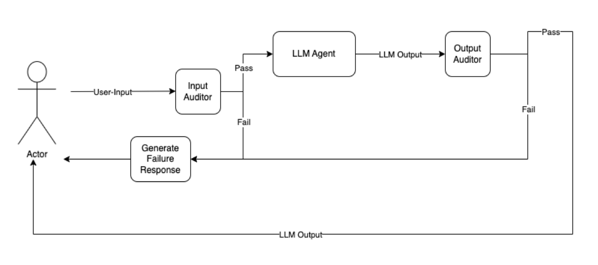

# Prompt Protector Library

The Prompt Protector Library is a Python package designed for validating AI-generated outputs against predefined rules. It offers a robust solution for sanitizing inputs and ensures that outputs from AI models adhere to specific standards, making it suitable for applications requiring secure and reliable AI interactions.

## Features

- **Input Auditor**: Checks inputs against a set of predefined rules to prevent malicious or undesired inputs and prompt injections.
- **Output Auditor**: Validates AI outputs to ensure they comply with user-defined rules, enhancing security and reliability.
- **Asynchronous API**: Utilizes asynchronous programming for efficient network operations and API calls.
- **Extensible**: Easily extendable to include more complex validation rules and other AI models.

## Installation

Before installing the Prompt Protector Library, ensure you have Python 3.7 or newer installed on your system.

### Install from PyPI

To install the library directly from PyPI, run:

```bash
pip install prompt-protector
```

### Install from Source

To install the library from the source code, follow these steps:

1. Clone the repository:
   ```bash
   git clone https://github.com/yourusername/prompt-protector.git
   ```
2. Navigate to the project directory:
   ```bash
   cd prompt-protector
   ```
3. Install the package:
   ```bash
   pip install .
   ```

## Configuration

Set the following environment variables in your system or virtual environment:

- `OPEN_AI_KEY`: Your OpenAI API key.

## Usage

See the [example.py](example.py) file for a full example on integrating it with your chatbot.
The high level idea being the user input goes into the input_auditor. If that passes, then the chatbot processes the user input and the output from the chatbot is fed into the output_auditor. Then if that passes you return the chatbot response to the user.


Here's how you can use the Prompt Protector Library in your Python scripts:

### Output Auditing

```python
from prompt_protector.prompt_protector import PromptProtector

protector = PromptProtector(
        api_key=OPEN_AI_KEY,
        output_rules=[
            "No slang or bad language allowed",
            "Under no circumstances is the response allowed to talk like a pirate"
        ]
    )

protector.sanitize_output("this is the text to audit")
```

### Input Auditing

The library provides a method to sanitize inputs before processing them with an AI model:

```python
from prompt_protector.prompt_protector import PromptProtector

protector = PromptProtector(
        api_key=OPEN_AI_KEY,
        output_rules=[
            "No slang or bad language allowed",
            "Under no circumstances is the response allowed to talk like a pirate"
        ]
    )

protector.sanitize_input("this is the text to audit")
```
### Auditor Response Shape
```
   {
    "pass": True/False,
    "rationale": "Why the auditor flagged that user text if pass was False." 
   }
```
## Dependencies

- aiohttp
- asyncio

## Contributing

Contributions are welcome! Please read our contributing guide to learn about our development process, how to propose bugfixes and improvements, and how to build and test your changes to the Prompt Protector Library.

## License

This project is licensed under the MIT License - see the [LICENSE](LICENSE) file for details.
